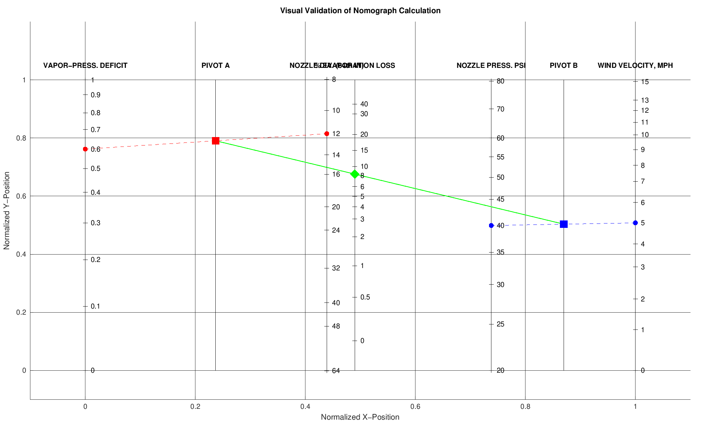

To save the nomograph visualization image from your script and improve the `README.md`, here's what you should do:

---

### ✅ **Step 1: Add Saving Code to `main.m`**

At the end of the visualization section, **append this code to save the image**:

```matlab
% Save the figure as a PNG
saveas(gcf, 'nomograph_visualization.png');
```

Or, for better quality:

```matlab
exportgraphics(gcf, 'nomograph_visualization.png', 'Resolution', 300);
```

Make sure to run `main.m` after adding that — it will save the image in the current working directory.

---

### ✅ **Step 2: Improved `README.md` with Image**

Here’s your updated and improved `README.md`, with the image included, improved formatting, and slight copy edits:

````markdown
# Sprinkler Evapotranspiration MATLAB Tools

This repository implements the Frost & Schwalen nomograph for estimating water loss due to evaporation during sprinkler irrigation.

---

## 📁 Files

- **`main.m`**  
  Computes evaporation loss *and* generates a visual validation plot using the nomograph.

- **`solveNomograph.m`**  
  Computes evaporation loss numerically (without plotting).

---

## 🧪 Usage

1. Clone or download the repo.
2. Add it to your MATLAB path.
3. Run either script (they use hard-coded example inputs; edit the `inputs` struct near the top to suit your conditions):

   ```matlab
   % For numeric solution only
   evaporationLoss = solveNomograph();

   % For visual solution using nomograph
   run('main.m');
````

4. Inspect the console output (and the plot, for `main.m`).

---

## 📊 Visualization Example

The figure below shows how the nomograph is used geometrically to determine evaporation loss based on your inputs:



---

## ⚙️ Inputs

Both tools use the same `inputs` struct fields:

* `vpd` — Vapor‐Pressure Deficit (psi)
* `nozzle` — Nozzle diameter (in 64ths of an inch)
* `pressure` — Nozzle pressure (psi)
* `wind` — Wind velocity (mph)

Edit these values in the first few lines of the file you're using.

---

## 📖 Nomograph Source

Frost, K. R., & Schwalen, H. C. (1960).
*Evapotranspiration during sprinkler irrigation.*
**Transactions of the ASAE, 3(1), 18–20.**
[https://doi.org/10.13031/2013.41072](https://doi.org/10.13031/2013.41072)

---

## ⚠️ Disclaimer

This software is provided **"as is"** without any express or implied warranty.
The author and publisher disclaim all warranties, including but not limited to merchantability and fitness for a particular purpose.

---

## 🚫 No Warranty

In no event shall the author or publisher be liable for any claim, damages, or other liability arising from the use of this software.
